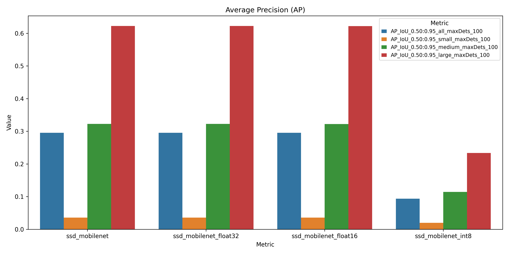
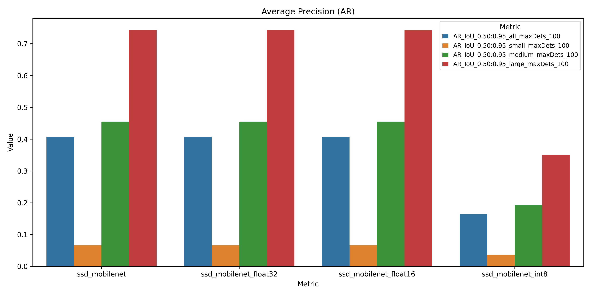
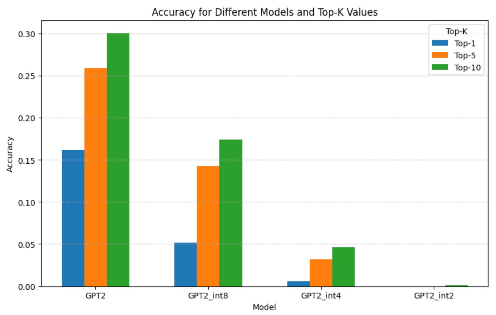

## Motivation

As AI models grow larger and more powerful, computational resource consumption also increases, leading to higher energy usage and greater carbon emissions. Consequently, these complex models are often not feasible for use on commodity machines or edge devices, which are becoming increasingly crucial in applications such as climate monitoring, autonomous traffic control, and real-time decision-making in remote or resource-constrained environments. Edge AI, which involves deploying AI models directly on edge devices like sensors, smartphones, and IoT devices, presents unique challenges in terms of model size, power efficiency, and latency, requiring models that are both lightweight and optimized for low-power, decentralized processing.

Various techniques, such as model pruning, distillation, and quantization, can reduce memory footprint and computational requirements during inference; however, these methods often come at the cost of model accuracy. This project focuses on post-training quantizing model weights to evaluate the trade-off between memory footprint reduction, inference time and accuracy loss.

## Methodology

Quantization reduces the precision of a model's weights by converting them from higher-bit representations (e.g., float32) to lower-bit formats (e.g., float16 or int8), which decreases the model's memory usage and computational requirements. However, this reduction in precision can lead to a slight loss in accuracy, as the lower-bit representations may not capture the full range of values as accurately as higher-precision formats.

We use the TFLiteConverter to convert TensorFlow models into TensorFlow Lite (TFLite) format, modifying the model weights from float32 to float16 and int8 representations. Finally, we evaluate the models' accuracy to assess the impact of these changes on performance.

## Results

### Object Detection Model

#### Inference Time and Memory Consumption

| Model                   | Memory Footprint (MB) | Mean Inference Time (s) |
|--------------------------|----------------------:|------------------------:|
| ssd_mobilenet_float32     |               23.720  |                0.115962 |
| ssd_mobilenet_float16     |               12.166  |                0.117698 |
| ssd_mobilenet_int8        |                6.707  |                0.167178 |

The float32 model has the largest memory footprint (23.72 MB) and the fastest inference time (0.1160s). The float16 model nearly halves the memory usage (12.17 MB) with minimal impact on speed (0.1177s). The int8 model reduces memory by 3.5x (6.71 MB) but increases inference time to 0.1672s.

#### Average Precision & Average Recall

The plot demonstrates that precision remains consistent between the float32 and float16 models, while the int8 model experiences a significant decline in performance. Across all image sizes, the int8 model shows consistently unsatisfactory results, indicating a noticeable loss in precision.

### Large Language Model

| Model        | Size in memory (MB) |
|--------------|---------------------|
| GPT2         | 474.72              |
| GPT2-int8    | 118.68              |
| GPT2-int4    | 59.34               |
| GPT2-int2    | 29.67               |

The standard GPT-2 model exhibits the largest memory footprint, measuring 474.72 MB. In comparison, the int8 model reduces the memory size to less than a quarter of the standard model. The int4 and int2 models occupy approximately half the memory of their respective predecessors, which aligns with expectations based on bit-width reductions.

The models struggle with prediction accuracy on their first try, with the standard model achieving only 15% accuracy, and the int8, int4, and int2 models performing significantly worse. Top-5 accuracy shows notable improvements, with the int8 and regular models improving by around 0.1, and the int4 model improving sixfold. Top-10 accuracy also improves, but the gains diminish as the models start generating repetitive or nonsensical predictions.
